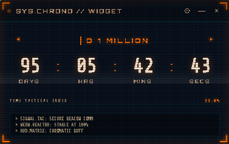

# D-daycounter

A sleek, modern **glassmorphic desktop countdown widget** for Windows. Set target dates for launches, deadlines, exams, trips, or milestones — D-daycounter shows a live, always-available countdown right on your desktop with modern glassmorphism aesthetics and neon accents.

Built with [Tauri 2](https://tauri.app/) (Rust + Web frontend), it is lightweight, fast, and integrates natively with Windows and AI Assistants via the **Model Context Protocol (MCP)**.

---

## 📸 Screenshots

| Widget Face | Settings Panel |
| :---: | :---: |
|  |  |

---

## 🌟 Key Features


* ⏳ **Live Countdown Display**: Tracks days, hours, minutes, and seconds in real-time.
* 🤖 **AI Assistant Integration (MCP Protocol)**: Control your widget directly from **Claude Desktop**, **Cursor**, **Antigravity**, or **VS Code**! Create timers, switch presets, and adjust settings via AI.
* ⚡ **1-Click Zero-Tech AI Setup**: Simply toggle **"Enable AI Control"** in Settings — the app automatically configures Claude Desktop and Cursor with 1 click. No terminal commands or manual JSON editing needed.
* ⚡ **Windows Named Pipe IPC**: Real-time live UI updates between connected AI models and the desktop widget.
* 📋 **Multiple Timeline Presets**: Store, manage, and switch between multiple countdown timers.
* 🎨 **Four Neon Energy Themes**: Cyan, Amber, Mint, and Orchid.
* 📌 **Always-on-Top & System Tray**: Keep the widget pinned above windows or collapse it cleanly to the Windows taskbar tray.
* 🚀 **Autostart on Boot**: Automatically launches at login so your timers are always ready.
* 🔄 **Built-in Auto-Updater**: Automatically checks for releases and includes a manual "Check for Updates" button in Settings.

---

## 🤖 AI Assistant Control (MCP Protocol)

D-Day Counter includes an embedded Model Context Protocol (MCP) server. Connected AI assistants can invoke 5 powerful tools:

| Tool | Description | Example AI Command |
|---|---|---|
| `create_timer` | Add a countdown target using ISO timestamp or relative offsets (`duration_hours`, `duration_minutes`, `duration_seconds`). | *"Set a 45 minute countdown for my study session"* |
| `list_timers` | Inspect all timers, target dates, and remaining seconds. | *"What countdowns do I have active?"* |
| `switch_timer` | Change the displayed timer on the widget by title or index. | *"Switch the display to Product Launch"* |
| `delete_timer` | Remove a countdown timer. | *"Remove the test timer"* |
| `update_settings` | Control opacity, themes, always-on-top, autostart, and window visibility. | *"Set widget theme to solar orange and bring it to top"* |

### 1-Click Automatic Setup
1. Open D-Day Counter Settings (⚙).
2. Toggle **Enable AI Control (Claude, Cursor)** to **ON**.
3. That's it! The app automatically configures installed AI apps on your computer.

### Manual MCP Setup
If configuring an AI client manually, point to the installed executable with `--mcp`:

```json
{
  "mcpServers": {
    "d-day-counter": {
      "command": "C:\\Program Files\\D-daycounter\\D-daycounter.exe",
      "args": ["--mcp"]
    }
  }
}
```

---

## 🚀 Download & Install

Download the latest installer from the [**Releases**](https://github.com/rithvikrthampy/D_Day_Counter/releases/latest) page:

* **`D-daycounter_x64-setup.exe`** — recommended Windows installer (NSIS).
* **`D-daycounter_x64_en-US.msi`** — alternative Windows Installer package.

> *Note: Windows SmartScreen may present a first-run prompt if the binary is un-signed. Click **More info → Run anyway** to proceed.*

---

## 🛠️ Build from Source

### Prerequisites
* [Rust](https://www.rust-lang.org/tools/install) (stable)
* [Node.js](https://nodejs.org/) (v18+)
* Windows Build Tools & Webview2

### Run in Development
```bash
npm install
npm run tauri dev
```

### Build Installers
```bash
npm run tauri build
```

---

## 🛠️ Tech Stack

* **[Tauri 2](https://tauri.app/)** — Native shell & Rust backend.
* **Tokio & Windows Named Pipes** — Asynchronous real-time IPC.
* **JSON5** — AST-aware, comment-tolerant config parsing.
* **Vanilla HTML5 / CSS3 / JavaScript** — Glassmorphism UI styling.

---

## 📄 License

Released under the [MIT License](LICENSE).
